# TAPS Contract

## Overview

The TAPS contract is a multi-wallet management system designed to provide varying levels of security based on the type of wallet and the operations performed. It allows users to vault and unvault assets, both in the form of tokens (ERC20, ERC721, and ERC1155) and Ether, between different wallet types. The primary goal of TAPS is to enhance asset security by leveraging the strengths of different wallet types and their associated risk profiles.

## Wallet and Vault Types

The system categorizes wallets/vaults into four types:

1. **Minting Wallet**: Primarily used for minting new tokens.
2. **Transaction Wallet**: Used for marketplace transactions.
3. **Social Vault**: A more secure vault used for interactions with one or multiple trusted contracts for access to ecosystems.
4. **Cold Vault**: The most secure vault, ideally air-gapped, used for long-term storage and seldom accessed.

## Key Features:

1. **Elimination of User Error**: TAPS eliminates the risk of user error during vaulting and unvaulting. Instead of manually entering addresses, users set their wallet configurations once. For subsequent operations, they simply specify the type of wallet or vault, reducing the risk of sending assets to the wrong address.

2. **Commitment Modes**: TAPS offers two commitment modes. In the "Non Signing Cold Vault Mode", the cold vault does not sign any transactions, offering a balance between security and flexibility. In the "Signing Cold Vault Mode", the cold vault can only sign transactions involving the TAPS contract, ensuring its isolation.

3. **Transition Risk Assessment**: TAPS provides a clear risk assessment for each type of transition, allowing users to make informed decisions about their asset management.

## Transition Descriptions

### Vaulting:
1. **Mint to Cold**: Assets minted are directly moved to the most secure vault, ensuring immediate security for newly created assets.
2. **Transaction to Cold**: After a marketplace transaction, assets can be moved to the cold vault for long-term safekeeping.
3. **Mint to Social**: Assets minted can be moved to the social vault for interactions with trusted contracts.
4. **Transaction to Social**: After a marketplace transaction, assets can be moved to the social vault for more secure, yet flexible storage.
5. **Social to Cold**: Assets in the social vault can be moved to the cold vault for maximum security.

### Unvaulting (NonSigningCold Mode):
1. **Social to Transfer**: Assets can be moved from the social vault to the transaction wallet for marketplace transactions.

### Unvaulting (SigningCold Mode):
1. **Cold to Social**: Assets can be moved from the cold vault to the social vault for interactions with trusted contracts.
2. **Social to Transfer**: Assets can be moved from the social vault to the transaction wallet for marketplace transactions.
3. **Cold to Transfer**: Assets can be moved directly from the cold vault to the transaction wallet.

## Commitment Modes

1. **Non Signing Cold Vault Mode**: In this mode, the cold vault does not sign any transactions, ensuring it remains completely isolated. This mode offers a balance between security and flexibility, allowing the social vault to handle most interactions while the cold vault remains untouched.

2. **Signing Cold Vault Mode**: In this mode, the cold vault is only allowed to sign transactions involving the TAPS contract. This ensures that the cold vault remains isolated from other contracts and potential vulnerabilities. This mode is ideal for users who prioritize maximum security and are willing to operate primarily through the social vault for other interactions.

## State Risk Assessment Table

| Wallet Type       | Action (Signing)                     | Historical Risk       | Overall Risk Ranking |
|-------------------|--------------------------------------|------------------------|----------------------|
| Cold Vault        | Never Signed                         | Minimal (Rare Hacks)   | 🟢 Maximum Security  |
| Cold Vault        | Single Source                        | Low                    | 🟢 High Security     |
| Social Vault      | Two Different Sources                | Medium                 | 🟡 Standard Security |
| Social Vault      | Trusted Multiple Sources             | Medium-High            | 🟡 Reduced Security  |
| Transaction Wallet| Marketplace Multiple Sources         | High (Infrequent Hacks)| 🟠 Low Security      |
| Minting Wallet    | Untrusted and Multiple Regular Signs | Very High (Frequent Hacks)| 🔴 Minimal Security|

## Transition Risk Assessment Flow Chart






**Note**: The risk rankings are based on historical data and common best practices. The actual risk can vary based on individual usage patterns, security practices, and other factors.

## Eliminating User Error

One of the primary advantages of the TAPS system is the significant reduction in user error during the vaulting and unvaulting processes. In traditional manual operations, users are required to copy and paste wallet addresses, which introduces a substantial risk of error. A single mistake in this process can result in assets being sent to the wrong address, potentially leading to irreversible losses.

With TAPS, users set their wallet addresses once, and from then on, they simply specify the "type" of wallet or vault they want their assets to move to. This not only streamlines the process but also eliminates the risks associated with manual address input. By abstracting away the need to deal with raw addresses for every transaction, TAPS provides a safer and more user-friendly experience.

## Running Tests

To run the tests for the TAPS contract, use the following command:

```bash
npx hardhat test test/TAPS.test.js
```

Ensure you have the necessary dependencies installed and the local environment set up correctly.

## Contract Functions Overview

### Wallet Configuration:

1. **setAllWalletAndVaultConfigs**: Set up all wallet configurations for a user. This includes the minting wallet, transaction wallet, social vault, and cold vault. Additionally, the commitment mode is set during this operation.

2. **swapMintingWallet**: Change the minting wallet for a user.
3. **swapTransactionWallet**: Change the transaction wallet for a user.
4. **swapSocialVault**: Change the social vault for a user.

### Vaulting and Unvaulting:

1. **vaultETH**: Vault Ether to a specified wallet type.
2. **unvaultETH**: Unvault Ether from a specified wallet type.
3. **vaultToken**: Vault a token (ERC20, ERC721, or ERC1155) to a specified wallet type.
4. **unvaultToken**: Unvault a token (ERC20, ERC721, or ERC1155) from a specified wallet type.

### Utility Functions:

1. **_transferToken**: Internal function to handle the transfer of tokens.
2. **_getDestination**: Determine the destination address based on the wallet type.
3. **_getSenderType**: Determine the type of the sender's wallet.

### Modifiers:

1. **onlyColdVault**: Ensure the function caller is the cold vault.
2. **validSenderWalletType**: Ensure the function caller is of a valid wallet type.

## Conclusion

The TAPS contract offers a comprehensive solution to asset management, balancing the need for security with the convenience of flexible operations. By categorizing wallets into different types, allowing for secure transitions, and eliminating common user errors, TAPS stands out as a robust tool for both novice and experienced users in the blockchain space. Whether you're looking for maximum security or operational flexibility, TAPS has got you covered.

## Run Contract Locally

npx hardhat node


npx hardhat run --network localhost scripts/deploy.js
